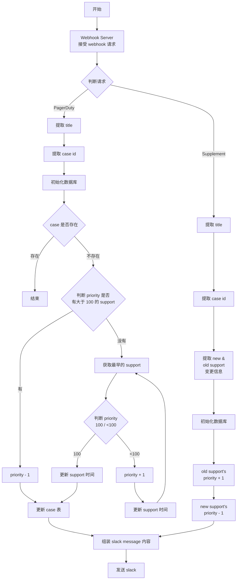

## 架构图

```mermaid
flowchart TD
    A[开始] --> B[Webhook Server\n接受 webhook 请求]
    B --> C{判断请求}
    C -->|PagerDuty| D[提取 title]
    D --> E[提取 case id]
    E --> F[初始化数据库]
    F --> G{case 是否存在}
    G -->|存在| H[结束]
    G -->|不存在| I{判断 priority 是否\n有大于 100 的 support}
    I -->|有| J[priority - 1]
    J --> K[更新 case 表]
    I -->|没有| L[获取最早的 support]
    L --> M{判断 priority\n100 / <100}
    M -->|100| N[更新 support 时间]
    N --> K
    M -->|<100| O[priority + 1]
    O --> P[更新 support 时间]
    P --> L
    K --> Q[组装 slack message 内容]
    C -->|Supplement| R[提取 title]
    R --> S[提取 case id]
    S --> T[提取 new &\nold support\n变更信息]
    T --> U[初始化数据库]
    U --> V[old support's\npriority + 1]
    V --> W[new support's\npriority - 1]
    W --> Q
    Q --> X[发送 slack]
```

